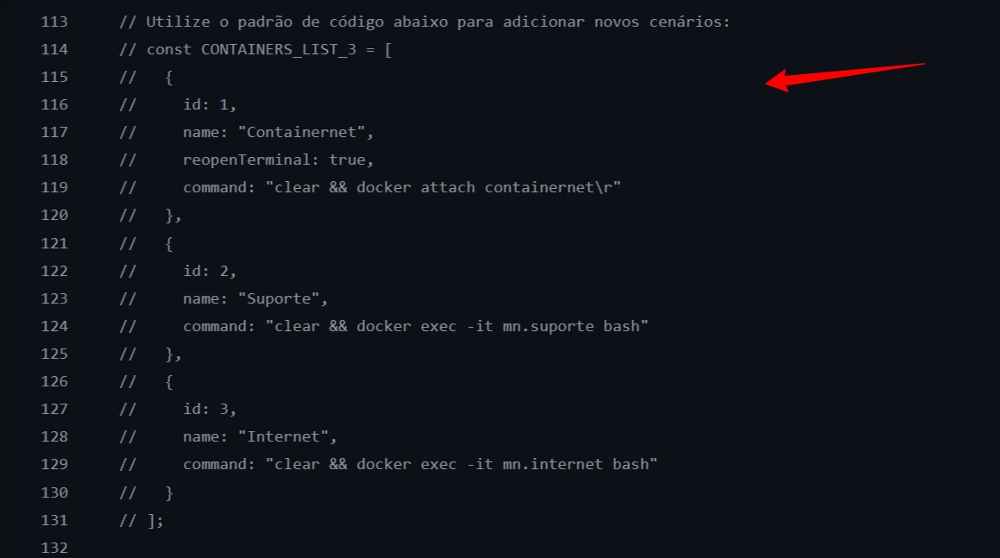
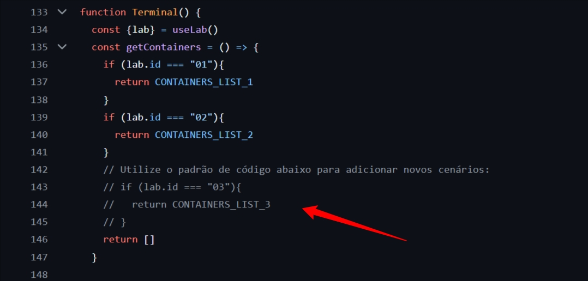

# ⚗️ Lab Cyber Academy Aplicação 🧪
<br>

Este repositório contém o código-fonte do front-end e back-end da aplicação do Lab Cyber Academy (LCA). Durante o processo de provisionamento, o repositório principal do projeto irá clonar este repositório, realizar a instalação das dependências, iniciar os serviços necessários e disponibilizá-los ao usuário final de forma automatizada.

---

<br>

## Frontend da Aplicação

O frontend da aplicação é desenvolvido em **React** e sua estrutura é simples e de fácil entendimento. É possível conferir o código acessando a pasta `frontend`.

Caso seja de interesse adicionar novos cenários de **cyber range**, é necessário realizar algumas adições no código-fonte. Alguns modelos de código foram deixados comentados para facilitar a implementação desses novos cenários, permitindo que futuros desenvolvedores testem suas próprias soluções por meio da nossa interface.

As modificações devem ser feitas nos seguintes arquivos:

- `Home/index.js`
- `Terminal/index.js`

Neles, é possível identificar os trechos onde deve ser implementada a descrição do novo laboratório.

---

<br>

## Backend da Aplicação

O back-end da aplicação foi desenvolvido em Go (Golang), com uma estrutura leve, eficiente e de fácil manutenção. A aplicação expõe uma interface WebSocket, responsável por intermediar a comunicação entre o frontend e um terminal remoto via SSH.

Ela permite que os usuários interajam diretamente com terminais de máquinas remotas por meio do navegador, além de executar scripts automatizados de inicialização de laboratórios com base na escolha do usuário.

Tanto o Front-end quanto o Back-end são executados na porta 9000 via arquivos de configuração Docker.


---

<br>

## Implementação de um novo laborátorio

Para incluir um novo laboratório, basta seguir o modelo de código comentado deixado nos dois únicos arquivos do frontend que precisam ser alterados: `Home/index.js` e `Terminal/index.js`.

Abaixo, um exemplo de inclusão do "Laboratório 03" no arquivo `frontend/src/pages/Home/index.js`, utilizando o modelo de código fornecido de forma comentada:

Primeira adição de código:


<br>

Em seguida, um exemplo da continuação da inclusão do "Laboratório 03" no arquivo `frontend/src/pages/Terminal/index.js`, também com base no código comentado.
Observe que, nesse segundo arquivo, será necessário realizar duas inclusões de código.


Primeira adição de código:


Segunda adição de código:


Atenção: não se esqueça de salvar todos os arquivos!

<br>

Para validar as modificações em ambiente local, utilize o seguinte comando no terminal:

```
docker compose up -d
```

<br>


#### Este repositório é uma extensão utilizada em conjunto ao repositório oficial: [⚗️ Lab Cyber Academy 🧪](https://github.com/vitorreiel/lab-cyber-academy).

<br>

---

<div style="display: inline_block;">

   

</div>
<div style="display: inline_block;">
   
   
   
   
   
   
</div>
